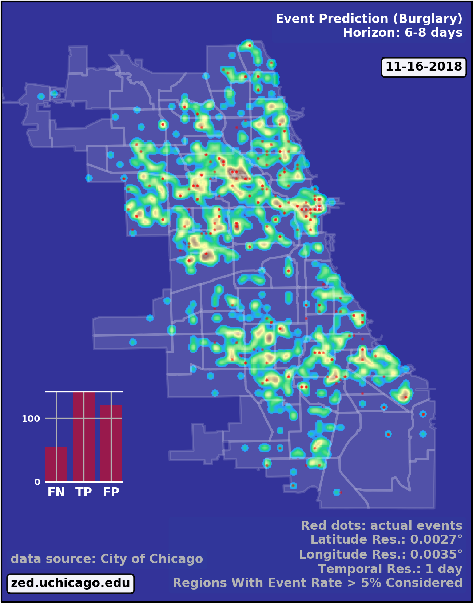

===============
Cynet
===============

.. image:: http://zed.uchicago.edu/logo/logozed1.png
   :height: 400px
   :scale: 50 %
   :alt: alternate text
   :align: center

|
:Info: See <https://arxiv.org/abs/1406.6651> for theoretical background
:Author: ZeD@UChicago <zed.uchicago.edu>
:Description: Implementation of the Deep Granger net inference algorithm, described
    in https://arxiv.org/abs/1406.6651, for learning spatio-temporal stochastic processes
    (*point processes*). **cynet** learns a network of generative local models, without assuming
    any specific model structure.

**Introduction:**
    Cynet is a python wrapper for a C++ implementation of the Deep Granger network
    inference algorithm. This package seeks to assist in the parsing of raw data
    into appropriate formats and then building predictive models from them. This
    document will go through an example of how to use this package with the
    Chicago crime dataset to build and evaluate predictive models. We use these
    predictions to draw an example of predictive heatmaps.

|

**Dataset:**
    <https://data.cityofchicago.org/Public-Safety/Crimes-2001-to-present/ijzp-q8t2>
|

**Chicago Boundaries shape files:**
    <https://data.cityofchicago.org/Facilities-Geographic-Boundaries/Boundaries-Community-Areas-current-/cauq-8yn6>

|

**Installaion:**

.. code-block:: bash

    pip install cynet
|

**Contents:**
    1. Processing raw data into xGenESeSS friendly format.
    2. Generating models using xGenESeSS.
    3. Running Cynet binary to get predictions log files and statistics.
    4. Generating prediction csvs.
    5. Using predictions to generate predictive heat maps.

|

**Section 1: Processing raw data into xGenESeSS friendly format.**
    The goal of this section is to show how to turn the raw Chicago crime data into
    a format appropriate for xGenESeSS.

|
**1.1: The Crime dataset.**
    The Chicago crime dataset is a large csv which can be downloaded from the link
    above. It is frequently updated and contains reported crime events from 2001
    to present. There are about 6.8 million rows, one for each recorded event.
    There are 22 different columns, one for a different variable. For our purposes,
    the important variables are:

    * Date: Contains the date and time at which the event took place.
    * Primary Type: the type of the crime. Includes but not limited to: Battery, Assault, Theft, Criminal Damage, Burglary, Motor Vehicle Theft.
    * Arrest: Inidicates if an arrest was made.
    * Latitude: Latitude coordinate of the event.
    * Longitude: Longitude coordinate of the event.
    |
    We will use these above variables to help parse the data into the appropriate format.
|
**1.2: The desired file formats and time series table.**

    To generate the Xgenesis models, we need three types of files. These three files
    constitutes a time series table. Each row in the table will describe a tile in our
    grid. Tiles are defined by coordinate boundaries and a variable type. That is,
    tiles with the same latitude and longitude boundaries but with different variables
    will count as separate tiles in this table. The column headers in this case will be
    time slices. The time slices in our example will be days. Each value in the table
    will be an integer describing the number of events that took place at that
    particular tile, within that particular time slice.

|
**Files and examples:**

Column file. The columns (time slices) in our table. In this example, they are one day
long.

.. code-block:: bash

    2014-01-01T00:00:00.000000000
    2014-01-02T00:00:00.000000000
    2014-01-03T00:00:00.000000000
    2014-01-04T00:00:00.000000000
    2014-01-05T00:00:00.000000000
    ...

Coordinate file. The rows (tiles) in our table:

.. code-block:: bash

    42.0196#42.02236#-87.66784#-87.66432#VAR
    42.0196#42.02236#-87.66784#-87.66432#BURGLARY-THEFT-MOTOR_VEHICLE_THEFT
    42.0196#42.02236#-87.66784#-87.66432#HOMICIDE-ASSAULT-BATTERY
    41.74874#41.75151#-87.57286#-87.56935#VAR
    41.74874#41.75151#-87.57286#-87.56935#BURGLARY-THEFT-MOTOR_VEHICLE_THEFT
    41.74874#41.75151#-87.57286#-87.56935#HOMICIDE-ASSAULT-BATTERY
    ...

Csv file. The actual timeseries:

.. code-block:: bash

    0 1 1 0 2 0 1 ...
    0 0 0 1 0 2 0 ...
    0 1 1 0 0 0 1 ...
    0 0 0 1 1 2 0 ...
    ...

If these examples are taken together, then the table implies that for the the
tile **42.0196#42.02236#-87.66784#-87.66432#VAR**, 0 events took place on 1/1/2014,
1 on 1/2/2014, 1 on 1/3/2014, 0 on 1/4/2014, 2 on 1/5/2014, etc.

|
|
**1.3: Intermediate Time Series Tables.**

        Here we begin processing the csv into the desired formats. The spatioTemporal
    class is used for this. This step will take a bit of time to run. We will fit the
    data from 2001 to 2018. We will group the various types in the **Primary Type**
    column into three groups. For each of these groups, we will produce an intermediate
    timeseries table. In these csv files, the columns are the dates and the rows will
    start with a tile followed by the time series on that tile.

    .. code-block:: python

        import numpy as np
        EPS = 200

        grid={'Latitude':np.around(np.linspace(41.5,42.05,EPS),decimals=5),
              'Longitude':np.around(np.linspace(-87.9,-87.2,EPS),decimals=5),
              'Eps':EPS}

        tiles=list([[grid['Latitude'][i],grid['Latitude'][i+1],grid['Longitude'][j], grid['Longitude'][j+1]]
                    for i in np.arange(len(grid['Latitude'])-1)
                    for j in np.arange(len(grid['Longitude'])-1)])

    **tiles** is generated using **grid** and **EPS**. In grid, we define the
    latitude longitude boundaries of Chicago. We divide the boundaries into
    sections based on EPS. Then coordinates are paired up to made a list of list (**tiles**).
    Each inner list is in the format [latitude 1, latitude 2, longitude 1, longitude 2]
    and represents the boundaries for a tile. Note that **EPS** will dictate how finely
    the grid is divided and thus controls the number of tiles. Please feel free to lower
    EPS to a lower integer to decrease run time.

    .. code-block:: python

        import cynet.cynet as cn

        STOREFILE='crime.p'
        CSVFILE='crime.csv'

        S0=cn.spatioTemporal(log_file=CSVFILE,
                             log_store=STOREFILE,
                             types=[['BURGLARY','THEFT','MOTOR VEHICLE THEFT']],
                             value_limits=None,
                             grid=tiles,
                             init_date='2001-01-01',
                             end_date='2018-12-31',
                             freq='D',
                             EVENT='Primary Type',
                             threshold=0.05)
        S0.fit(csvPREF='CRIME-')

    **CSVFILE** refers to the crime csv data file downloaded from the Chicago database.
    **STOREFILE** is where we will store the database as a pickle file incase it needs
    to be recalled.
    In the **S0** class, the following arguments are used.

    **EVENT:** which indicates the column name in the dataframe with which we
    will use to select events.

    **types:** list of list which defines the groups to be selected for. We only
    have one group here. Every event which falls into the specifed categories
    ('BURGLARY','THEFT','MOTOR VEHICLE THEFT') will be selected. Other categories
    are not counted.

    **value_limits:** Only for numerical categories. Set to none here.

    **init_date** and **end_date:** the date range of selection data.

    **freq:** how large the time slices are. 'D' indicates one day.

    **threshold:** A very important variable. It is not very interesting to predict
    areas in which there are not much crime. Hence, we are using this variable
    throw out tiles in which less than five percent of the time slices have an event.
    That is, we keep only tiles where there was an event in at least five percent of
    the days.

    |

    .. code-block:: python

        tiles=S0.getGrid()

        with open("tiles.txt", "wb") as tiles_pickle:
            pickle.dump(tiles,tiles_pickle)

    After throwing out the tiles which had lower than five percent event rate, we
    retrieve those tiles that are left over with getGrid(). We store them as a pickle
    for later use.

    In sum, the script (**Script 1**) that will be run is

    .. code-block:: python

        import cynet.cynet as cn
        import numpy as np
        import pickle

        EPS = 200
        STOREFILE='crime.p'
        CSVFILE='crime.csv'

        grid={'Latitude':np.around(np.linspace(41.5,42.05,EPS),decimals=5),
              'Longitude':np.around(np.linspace(-87.9,-87.2,EPS),decimals=5),
              'Eps':EPS}

        tiles=list([[grid['Latitude'][i],grid['Latitude'][i+1],grid['Longitude'][j], grid['Longitude'][j+1]]
                    for i in np.arange(len(grid['Latitude'])-1)
                    for j in np.arange(len(grid['Longitude'])-1)])

        S0=cn.spatioTemporal(log_file=CSVFILE,
                             log_store=STOREFILE,
                             types=[['BURGLARY','THEFT','MOTOR VEHICLE THEFT']],
                             value_limits=None,
                             grid=tiles,
                             init_date='2001-01-01',
                             end_date='2018-12-31',
                             freq='D',
                             EVENT='Primary Type',
                             threshold=0.05)
        S0.fit(csvPREF='CRIME-')
        tiles=S0.getGrid()

        with open("tiles.txt", "wb") as tiles_pickle:
            pickle.dump(tiles,tiles_pickle)

    **Script 1** creates tiles.txt, crime.p, and CRIME-BURGLARY-THEFT-MOTOR_VEHICLE_THEFT.csv.
    This csv is the intermediate time series table mentioned above. However, it is only one of
    them. We will create two more.

    **Script 2**

    .. code-block:: python

        import cynet.cynet as cn
        import pickle

        STOREFILE='crime.p'
        CSVFILE='crime.csv'

        with open("tiles.txt", "rb") as tiles_pickle:
            tiles = pickle.load(tiles_pickle)

        S01=cn.spatioTemporal(log_store=STOREFILE,
                             types=[['HOMICIDE','ASSAULT','BATTERY']],
                             value_limits=None,
                             grid=tiles,
                             init_date='2001-01-01',
                             end_date='2018-12-31',
                             freq='D',threshold=0.05)
        S01.fit(csvPREF='CRIME-')

    This is very much like **Script 1** with the only difference being that it loads
    in the previously stored tiles. This will produce another intermediate
    time series table for another group of categories. The csv is called
    CRIME-HOMICIDE-ASSAULT-BATTERY.csv We do not change the tiles
    with get grid as that will make the tiles used for all three scripts to be different.

    **Script 3:**

    .. code-block:: python

        import cynet.cynet as cn
        import pickle

        STOREFILE='crime.p'
        CSVFILE='crime.csv'

        with open("tiles.txt", "rb") as tiles_pickle:
            tiles = pickle.load(tiles_pickle)

        S2=cn.spatioTemporal(log_store=STOREFILE,
                            types=None,
                            value_limits=[0,1],
                            grid=tiles,
                            init_date='2001-01-01',
                            end_date='2018-12-31',
                            freq='D', EVENT='Arrest',
                            threshold=0.05)
        S2.fit(csvPREF='ARREST')

    This script is slightly different from the last two. By leaving types as None,
    all of the categories in "Primary Type" will be counted. Instead, we filter by
    the "Arrest" column. This time, we are creating a time  series table whose tiles
    had a crime which resulted in an arrest in at least five percent of the days.
    The CSV created here will called ARREST.csv.

    The three intermediate time series tables we have now are:

    * CRIME-BURGLARY-THEFT-MOTOR_VEHICLE_THEFT.csv (Nonviolent Crimes)
    * CRIME-HOMICIDE-ASSAULT-BATTERY.csv (Violent Crimes)
    * ARREST.csv (All Categories)
    |
    As explained above, the columns in these csvs will be dates. Each row will be will
    be a tile followed by that tile's timeseries. The tiles will look like so:

    * 41.65477#41.65754#-87.61508#-87.61156#CRIME-BURGLARY-THEFT-MOTOR_VEHICLE_THEFT
    * 41.65477#41.65754#-87.61508#-87.61156#HOMICIDE-ASSAULT-BATTERY
    * 41.65477#41.65754#-87.61508#-87.61156#VAR
    |

    In the first two we combine the names of the category and use that as the type name
    of the tile. In the ARREST csv, we use "VAR" to indicate that any category in
    "Primary Type" counted. Lastly, the scripts are run separately because each can have high
    run time depending on how large **EPS** is.
|

**1.4: Generating the coordinate, column, and csv files.**
    Now it is time to generate the file formats appropriate for xGenESeSS.
    We will use the date range 2015-01-01 - 2017-12-31 as our training data.
    The period 2017-12-31 - 2018-12-31 will be our out of sample data. We will store
    the three desired files in a folder named 'triplets'. The out of sample data we store in
    a folder called 'split'.

    **Script 4:**

    .. code-block:: python

        import cynet.cynet as cn

        CSVfile = ['ARREST.csv','CRIME-BURGLARY-THEFT-MOTOR_VEHICLE_THEFT.csv','CRIME-HOMICIDE-ASSAULT-BATTERY.csv']
        begin = '2015-01-01'
        end = '2017-12-31'
        extended_end = '2018-12-31'
        name = 'triplet/' + 'CRIME-'+'_' + begin + '_' + end

        #Generates desired triplets.
        cn.readTS(CSVfile,csvNAME=name,BEG=begin,END=end)

        #Generates files which contains in sample and out of sample data.
        cn.splitTS(CSVfile, BEG = begin, END = extended_end, dirname = './split', prefix = begin + '_' + extended_end)

    We combine all the csvs produced in the last step. Recall that their columns,
    the dates, are all the same. The number of tiles in each file may be different,
    but they do not necessarily need to be the same. We take each of the csvs and stack
    them on top of each other. This table is pulled apart into the three files described
    in section 1.1. All tile names will go into a .coords file. The dates will go into
    a .columns file. Lastly, the time series for each tile will go into a .csv file.

    The three files will be:

    * CRIME-_2016-01-01_2018-12-31.csv
    * CRIME-_2016-01-01_2018-12-31.coordss
    * CRIME-_2016-01-01_2018-12-31.columns

    We will discuss the split files that were placed into the split folder later.
|
**Section 2: Creating the xGenESeSS models.**

**2.1 xGenESeSS and settings.**
    With the three files constituting the time series table prepared, it is time
    to produce xGenESeSS models. Doing so will require the **xGenESeSS binary**.
    There are many variables that can be set with in this process. We use a yaml file,
    **config.yaml**, to have our settings in one place.

    .. code-block:: yaml

        #YAML Configuration

        # path to file which has the rowwise multiline time series data
        TS_PATH: './CRIME-_2015-01-01_2017-12-31.csv'

        # path to file with name of the variables
        NAME_PATH: './CRIME-_2015-01-01_2017-12-31.coords'

        # path to log file for xgenesess inference
        LOG_PATH: 'log.txt'

        # xgenesses run parameters (these are not hyperparameters, Beg is 0, End is whatever tempral memory is)
        END: 60
        BEG: 0

        # number of restarts (20 is good)
        NUM: 2

        # partition sequence (we can specify different partition for each time series. XgenESeSS already has this capability)
        PARTITION:
        - 0.5

        # number of models to use in prediction (using cynet binary)
        model_nums:
        - 85

        # prediction horizons to test in unit of temporal quantization (using cynet binary)
        horizons:
        - 7

        # length of run using cynet (generally length of individual ts in split folder)

        RUNLEN: 1460

        #Periods to predict for
        FLEX_TAIL_LEN: 365

        # path to split series

        DATA_PATH: '../split/2015-01-01_2018-12-31'

        # path to models
        FILEPATH: 'models/'

        # glob string that matches all the model.json files.
        MODEL_GLOB: 'models/*model.json'

        # number of processors to use for post process models
        NUMPROC: 10

        # path to where result files are stored
        RESPATH: './models/*model*res'

        # path to XgenESeSS binary
        XgenESeSS: '../bin/XgenESeSS'

        # do we run XgenESeSS binary locally, or do we produce a list of commands to be run via phnx
        RUN_LOCAL: 0

        # max distance cutoff in render network
        MAX_DIST: 3

        # min distance cutoff in render network
        MIN_DIST: 0.1

        # max gamma cutoff in render network
        MAX_GAMMA: 0.95

        # min gamma cutoff in render network
        MIN_GAMMA: 0.25

        # colormap in render network
        COLORMAP: 'Reds'

**2.2: Generating xGenESeSS commands.**
    The important settings for this step are:
        * TS_PATH
        * NAME_PATH
        * LOG_PATH
        * END and BEG
        * NUM
        * PARTITION
        * RUN_LOCAL
    |
    Cynet provides a class that will generate a file which will generate the commands
    which will need to be run.

    **Script 5:**

    .. code-block:: python

        import cynet.cynet as cn
        import yaml

        stream = file('config.yaml', 'r')
        settings_dict=yaml.load(stream)

        TS_PATH=settings_dict['TS_PATH']
        NAME_PATH=settings_dict['NAME_PATH']
        LOG_PATH=settings_dict['LOG_PATH']
        FILEPATH=settings_dict['FILEPATH']
        END=settings_dict['END']
        BEG=settings_dict['BEG']
        NUM=settings_dict['NUM']
        PARTITION=settings_dict['PARTITION']
        XgenESeSS=settings_dict['XgenESeSS']
        RUN_LOCAL=settings_dict['RUN_LOCAL']

        XG = cn.xgModels(TS_PATH,NAME_PATH, LOG_PATH,FILEPATH, BEG, END, NUM, PARTITION, XgenESeSS,RUN_LOCAL)
        XG.run(workers=4)

    **Script 5** calls in the required settigs and generates a **program_calls.txt**
    containing all the XGenESeSS commands that need to be called. There will be one
    command for every tile in our timeseries table. Alternatively, if RUN_LOCAL is set to
    True, XG.run() will run the commands locally instead. This is generally not recommended
    unless

    One of the commands should look like this. xGenESeSS command for tile 1592.

    .. code-block:: bash

        ../bin/XgenESeSS -f ./CRIME-_2015-01-01_2017-12-31.csv -k "  :1592 "  -B 0
        -E 60 -n 2 -p 0.5 -S -N ./CRIME-_2015-01-01_2017-12-31.coords -l models/1592log.txt
        -m -g 0.01 -G 10000 -v 0 -A .5 -q -w models/1592

    **Section 2.3: Running the commands.**

    Whether you run the commands locally or on a computing cluster, the directory
    needs to be set up properly. For the settings above, our directory looks like this.

    .. code-block:: bash

        ..
        |-- bin/
        |   |-- XgenESeSS
        |-- payload2015_2017/
             | -- CRIME-_2015-01-01_2017-12-31.columns
             | -- CRIME-_2015-01-01_2017-12-31.coords
             | -- CRIME-_2015-01-01_2017-12-31.csv
             | -- models/

    Running all of the xGenESeSS commands listed in program_calls.txt will output
    *model.json files inside the models directory. One model file will appear for each tile.
    If you are running on the Uchicago computing cluster, the following settings work well.

    .. code-block:: bash

        USER UserID
        MAX_PARALLEL_JOBS 100
        INTERVAL 60
        PARTITION broadwl
        RUNTIME 1
        QOS normal
        MEM 10G
        NODES 1
        TPC 28
        RUNTIME_LIMIT 35

**Section 3: Running Cynet to get prediction log files and statistics.**

**3.1: Split files.**
    Once the model json files have been produced, it is time to run the cynet binary.
    There were files produced by **Script 4** in section 1.4 that outputted to a folder
    called split. We set their prefix to be a combination of the beginning and end dates
    As a result, the name of each file is their date range combined with the tile name.
    Below is an example.

    .. code-block:: bash

        2015-01-01_2018-12-3142.01633#42.02755#-87.67143#-87.65714#HOMICIDE-ASSAULT-BATTERY

    The contents of these files are simply that tile's time series within the data range.
    We currently have these split files set to be one year longer, in length, compared
    to the training data. The training data was dated 01/01/2015 - 12/31/2017. Three
    years or 1195 days (365 times 3). The split files are dated 01/01/2015 - 12/31/2018.
    This four years or 1460 days (365 * 4). Hence, the split file contains the time series
    of the training, in sample period, and the out of sample data (the year of 2018).
    **RUNLEN** will be the length of the split files, 1460. **FLEX_TAIL_LEN** will be
    the length of the out of sample data, 365. **DATA_PATH** is the path from the working
    directory to the split folder combined with the date prefix. **See the yaml configuration
    above.**

    With the working directory being **payload2015_2017/,** the directory tree in this
    example looks like this.

    .. code-block:: bash

        ..
        |-- bin/
        |   |-- XgenESeSS
        |-- payload2015_2017/
        |    | -- CRIME-_2015-01-01_2017-12-31.columns
        |    | -- CRIME-_2015-01-01_2017-12-31.coords
        |    | -- CRIME-_2015-01-01_2017-12-31.csv
        |    | -- models/
        |         | -- *model.json (multiple)
        |--split/
           | -- 2015-01-01_2018-12-31* (multiple)

**3.2: Cynet Log files.**

    Cynet takes the model json files and split files to create log files. A log file
    is produced for each tile. The names of these log files will contain its tile number,
    the number of models used in generating its **predicted time series,** and the
    source variable type used to make the predictions.

    .. code-block:: bash

        9modeluse85models#HOMICIDE-ASSAULT-BATTERY.log

    This is in the format (tile number)modeluse(number of predictor tiles used)models#(source variable).log

    Inside the log files is, in order, information on the target tile of the predictions, the
    number of the time slice (day), if an event actually happened,
    probability threshold of non-event, and probability threshold of event.

    .. code-block:: bash

        ----> 41.67688#41.67965#-87.66432#-87.6608#VAR 7 0 0.793203 0.206797
        ----> 41.67688#41.67965#-87.66432#-87.6608#VAR 8 0 0.791338 0.208662
        ----> 41.67688#41.67965#-87.66432#-87.6608#VAR 9 1 0.793203 0.206797
        ----> 41.67688#41.67965#-87.66432#-87.6608#VAR 10 1 0.791795 0.208205
        ----> 41.67688#41.67965#-87.66432#-87.6608#VAR 11 0 0.782952 0.217048
        ----> 41.67688#41.67965#-87.66432#-87.6608#VAR 12 0 0.788287 0.211713
        ----> 41.67688#41.67965#-87.66432#-87.6608#VAR 13 0 0.787275 0.212725
        ----> 41.67688#41.67965#-87.66432#-87.6608#VAR 14 0 0.786255 0.213745
        ----> 41.67688#41.67965#-87.66432#-87.6608#VAR 15 0 0.790431 0.209569
        ----> 41.67688#41.67965#-87.66432#-87.6608#VAR 16 0 0.797401 0.202599
        ...

    We are using variables to predict one another. In the above, we are Using
    the variable **HOMICIDE-ASSAULT-BATTERY**, the source, to predict **VAR**, the target.

**3.3: Running cynet to generate log files.**

    To create these log files from model json and split files, cynet uses the
    run_parallel function.

    **Script 6**

    .. code-block:: python

        import cynet.cynet as cn
        import yaml
        import glob

        stream = file('config.yaml', 'r')
        settings_dict = yaml.load(stream)

        model_nums = settings_dict['model_nums']
        MODEL_GLOB = settings_dict['MODEL_GLOB']
        horizon = settings_dict['horizons'][0]
        DATA_PATH = settings_dict['DATA_PATH']
        RUNLEN = settings_dict['RUNLEN']
        RESPATH = settings_dict['RESPATH']
        FLEX_TAIL_LEN = settings_dict['FLEX_TAIL_LEN']
        VARNAME=list(set([i.split('#')[-1] for i in glob.glob(DATA_PATH+"*")]))+['ALL']

        cn.run_pipeline(MODEL_GLOB,model_nums, horizon, DATA_PATH, RUNLEN, VARNAME, RESPATH,\
            FLEX_TAIL_LEN=FLEX_TAIL_LEN,cores=4,gamma=True)

    Once again, load in necessary parameters from the yaml configuration file. The cores
    argument defines the number of cpus that will be used to run cynet in parallel.
    We can sort the models by gamma or distance. **NEEDS TO BE FILLED IN. WHAT IS GAMMA**.
    Distance is the distance between the source and target tiles. **VARNAME**
    is a list of the different variable types of the tiles and ALL. These will be
    the sources in the predictions. ALL indicates that
    all model types are being used in the prediction.The log files will be placed in the
    models folder, at least in this example.

**3.4: tpr, fpr, and auc statistics.(WIP)**
    Aside from the cynet log files produced in the designated directory(**models/**),
    **res** or result csvs are also placed into the directory. Recall that we are
    using different variable types to predict each other. For example, we use:

    * VAR to predict HOMICIDE-ASSAULT-BATTERY
    * HOMICIDE-ASSAULT-BATTERY to predict BURGLARY-THEFT-MOTOR_VEHICLE_THEFT
    * ALL to predict VAR

    and so on. In these result files are auc (area under curve), tpr (true positive rate),
    and fpr (false positive rate) statistics on the model's preformance.

    .. code-block:: bash

        loc_id,lattgt1,lattgt2,lontgt1,lontgt2,varsrc,vartgt,num_models,auc,tpr,fpr,horizon
        models/9model,41.67688,41.67965,-87.64322,-87.6397,VAR,VAR,85,0.802666,0.518072,0.403226,7
        models/9model,41.67688,41.67965,-87.64322,-87.6397,HOMICIDE-ASSAULT-BATTERY,VAR,85,0.770124,0.494382,0.453488,7
        models/9model,41.67688,41.67965,-87.64322,-87.6397,BURGLARY-THEFT-MOTOR_VEHICLE_THEFT,VAR,85,0.767714,0.333333,0.397661,7
        models/9model,41.67688,41.67965,-87.64322,-87.6397,ALL,VAR,85,0.80817,0.487805,0.338624,7

    The **loc_id** gives the name of the model file. **varsrc** is the variable of the source of
    the predictions. **vartgt** is the the variable type of the tile for which the prediction
    is being made. Note that **vartgt** is all the same, VAR. This is the result file for
    one tile, and predictions are coming in from other tiles. Hence, the third(including the header)
    line of the above result file contains statistics on the performance of the predictions
    made by all tiles using the variable HOMICIDE-ASSAULT-BATTERY (source). These predictions
    are made for events at the tile given by the boundaries the longitude and latitude parameters
    plus the VAR variable.

    The result files for every tile is combined into a single csv called **all_res.csv**
    and placed into the working directory by **run_pipeline()**.

**3.5: Plotting statistics**

    Plotting the statistics is done once **all_res.csv** is produced. We provide
    a simple script.

    **Script 7**

    .. code-block:: python

        import cynet.cynet as cn

            VARNAMES=['BURGLARY-THEFT-MOTOR_VEHICLE_THEFT','HOMICIDE-ASSAULT-BATTERY','VAR']

            cn.get_var('res_all.csv',['lattgt1','lattgt2','lontgt1','lontgt2','vartgt'],varname='auc',VARNAMES=VARNAMES)
            cn.get_var('res_all.csv',['lattgt1','lattgt2','lontgt1','lontgt2','vartgt'],varname='tpr',VARNAMES=VARNAMES)
            cn.get_var('res_all.csv',['lattgt1','lattgt2','lontgt1','lontgt2','vartgt'],varname='fpr',VARNAMES=VARNAMES)
            cn.get_var('res_all.csv',['lattgt1','lattgt2','lontgt1','lontgt2'],varname='tpr',VARNAMES=VARNAMES)
            cn.get_var('res_all.csv',['lattgt1','lattgt2','lontgt1','lontgt2'],varname='auc',VARNAMES=VARNAMES)
            cn.get_var('res_all.csv',['lattgt1','lattgt2','lontgt1','lontgt2'],varname='fpr',VARNAMES=VARNAMES)

    This produces various plots. It should be obvious what each plot is. The auc
    is included below.

    GRAPH NEEDS TO BE REPLACED

    .. image:: payload2015_2017/auc.pdf

**Section 4: Generating prediction csvs.**

**4.1: The flexroc binary.**

    The flexroc binary is one of the cynet package's tools for calculating auc, tpr,
    and fpr statistics. Recall that in each of the log files, there is a series of
    positive event probabilities. One probability is given for each day. Example
    from section 3.2.

    .. code-block:: bash

        ----> 41.67688#41.67965#-87.66432#-87.6608#VAR 7 0 0.793203 0.206797
        ----> 41.67688#41.67965#-87.66432#-87.6608#VAR 8 0 0.791338 0.208662
        ----> 41.67688#41.67965#-87.66432#-87.6608#VAR 9 1 0.793203 0.206797
        ----> 41.67688#41.67965#-87.66432#-87.6608#VAR 10 1 0.791795 0.208205
        ----> 41.67688#41.67965#-87.66432#-87.6608#VAR 11 0 0.782952 0.217048
        ----> 41.67688#41.67965#-87.66432#-87.6608#VAR 12 0 0.788287 0.211713
        ----> 41.67688#41.67965#-87.66432#-87.6608#VAR 13 0 0.787275 0.212725
        ----> 41.67688#41.67965#-87.66432#-87.6608#VAR 14 0 0.786255 0.213745
        ----> 41.67688#41.67965#-87.66432#-87.6608#VAR 15 0 0.790431 0.209569
        ----> 41.67688#41.67965#-87.66432#-87.6608#VAR 16 0 0.797401 0.202599
        ...

    The positive event probabilities are in the last column. Suppose we were to choose
    a threshold for these probabilities. On days where the probability is higher
    than this threshold, then, we would say there is a predicted event.
    On days where the probability is lower than this threshold, then a non event is
    predicted for that day. One can imagine that if the threshold is fixed very low,
    then more events will be predicted. In this case, we will capture more of the
    actual events, but will have more false positives. On the other hand, if the threshold
    is set very high, then fewer events will be predicted and we will have more
    false negatives.
    |

    The **flexroc** binary allows us to specify a desired true positive rate,tpr, or
    false positive rate,fpr. It takes the log file and returns the threshold that should
    be used to achieve either the desired tpr or fpr. We can then use that threshold
    to map the positive event probabilities into a series of actual events.

**4.2: Prediction csvs.**

    Aside from mapping the series of probabilities into predictions, we would also like
    to transform the cynet log files into a more manageable forms. We'd like to generate
    csvs which contain the information in the log files as well as the mapped event
    series.

    .. code-block:: bash

        lat1,lat2,lon1,lon2,target,day,actual_event,negative_event,positive_event,predictions,source,threshold
        41.67688,41.67965,-87.64322,-87.6397,VAR,7,0,0.780455,0.219545,1,BURGLARY-THEFT-MOTOR_VEHICLE_THEFT,0.1207
        41.67688,41.67965,-87.64322,-87.6397,VAR,8,0,0.776299,0.223701,1,BURGLARY-THEFT-MOTOR_VEHICLE_THEFT,0.1207
        41.67688,41.67965,-87.64322,-87.6397,VAR,9,0,0.80419,0.19581,1,BURGLARY-THEFT-MOTOR_VEHICLE_THEFT,0.1207
        41.67688,41.67965,-87.64322,-87.6397,VAR,10,0,0.783441,0.216559,1,BURGLARY-THEFT-MOTOR_VEHICLE_THEFT,0.1207
        41.67688,41.67965,-87.64322,-87.6397,VAR,11,1,0.734133,0.265867,1,BURGLARY-THEFT-MOTOR_VEHICLE_THEFT,0.1207
        41.67688,41.67965,-87.64322,-87.6397,VAR,12,0,0.830888,0.169112,1,BURGLARY-THEFT-MOTOR_VEHICLE_THEFT,0.1207
        41.67688,41.67965,-87.64322,-87.6397,VAR,13,1,0.810834,0.189166,1,BURGLARY-THEFT-MOTOR_VEHICLE_THEFT,0.1207
        41.67688,41.67965,-87.64322,-87.6397,VAR,14,0,0.803271,0.196729,1,BURGLARY-THEFT-MOTOR_VEHICLE_THEFT,0.1207
        41.67688,41.67965,-87.64322,-87.6397,VAR,15,0,0.777034,0.222966,1,BURGLARY-THEFT-MOTOR_VEHICLE_THEFT,0.1207
        41.67688,41.67965,-87.64322,-87.6397,VAR,16,0,0.789064,0.210936,1,BURGLARY-THEFT-MOTOR_VEHICLE_THEFT,0.1207
        ...

    Note that the threshold used for the mapping is also given.

**4.3: Running flexroc.**

    Cynet provides a wrapper function for the flexroc binary, **flexroc_only_parallel**.
    It takes a specified tpr or fpr. It applies flexroc to desired log files, and
    for each log file returns the threshold necessary to achieve the desired rate.
    This implies that the threshold will likely be different between log files.

    **Script 8**

    .. code-block:: python

        import cynet.cynet as cn
        import yaml

        stream = file('config_pypi.yaml', 'r')
        settings_dict = yaml.load(stream)
        FLEX_TAIL_LEN = settings_dict['FLEX_TAIL_LEN']

        cn.flexroc_only_parallel('models/*.log',tpr_threshold=0.85,fpr_threshold=None,FLEX_TAIL_LEN=FLEX_TAIL_LEN, cores=4)

    As, described, **flexroc_only_parallel** will apply flexroc to all the log files
    matched by the glob string **models/*.log**. The desired tpr is set to 0.85, whereas
    the desired fpr is set to none. Again, only one can be chosen. **FLEX_TAIL_LEN**
    is retrieved from the yaml configuration and is 365 in this example. The required threshold
    for each log file is acquired and then applied to their probability series. The resulting
    event series and all the information in the log file is transferred in a csv file.
    A csv is created for each log file and will also be placed in the same directory
    as the log files.
|

**Section 5: Using predictions to generate predictive heat maps.**

**5.1: Combining the csvs.**
    We now have a csv for every tile. In this example, the csvs should have been placed
    in the models/ directory. The names of these files contain quite a bit of information.

    .. code-block:: bash

        4572modeluse85models#ALL#BURGLARY-THEFT-MOTOR_VEHICLE_THEFT.csv

    The above format implies that the tile number is 4572, the number of models
    used in prediction is 85, the source used to generate the predictions is **ALL**
    and the target predicted event is **BURGLARY-THEFT-MOTOR_VEHICLE_THEFT**. The contents
    of these csvs have already been described in section 4.2.
    |

    Imagine if we were do combine all csvs with **ALL** as the source. We would
    then have a single csv which contains all predictions on all tiles whose source
    was **ALL**. We could then use pandas to select for the target. In this example,
    we will generate a predictive heat map which uses **ALL** as the source and
    **BURGLARY-THEFT-MOTOR_VEHICLE_THEFT**. One can of course use other variables as the
    source or target.

    **Script 9**

    .. code-block:: python

        import cynet.cynet as cn

        mapper=cn.mapped_events('models/*85models#ALL#*.csv')
        mapper.concat_dataframes('85modelsALL.csv')

    The above script simply, combines all csvs matching the path **models/*85models#ALL#*.csv**
    and outputs them as the concentenated csv **85modelsALL.csv**.

**5.2: The heatmap settings.**
    We will use another yaml file to set our configurations.

    .. code-block:: yaml

        #Heatmap configurations

        #The variable which we use as the predictor of our events.
        source: 'ALL'

        #The types of events to be predicted. Only one used here, but can be more.
        types:
          - 'BURGLARY-THEFT-MOTOR_VEHICLE_THEFT'

        #The grace we allow ourselves. One day in this case.
        grace: 1

        #A setting used in the previous scripts. Used for generating our initial grid.
        EPS: 200

        #Boundaries of Chicago
        lat_min: 41.575
        lat_max: 42.05
        lon_min: -87.87
        lon_max: -87.5

        #The day number we are trying to predict on.
        day: 1415

        #Database
        predictions_csv: '85modelsALL.csv'

        #Shapefiles used. For drawing Chicago boundaries.
        shapefiles: 'shapefiles/geo_export_437d164b-0f27-49ac-9a3c-587a85d9f3b1'

        #Defines numer of tiles in our heatmap. Lower means more tiles. Will need to play around with this.
        radius: 0.006

        # How detailed out heatmap is. Lower means more detailed.
        detail: 0.0007

        #Intensity threshold
        min_intensity: 0.006

    Most of the above settings should be self-explanatory. **grace** is to give us
    some room in our predictions. That is, if we are able to predict an event
    within an error of 1 day, then we count that as a correct prediction. The **day** on
    which we are predicting events for is numbered 1415. The count starts from our beginning
    of our training period, 01-01-2015. The training period lasted until 12-31-2017,
    or 1095 days (3 years x 365 days). Therefore, day 1415 is 320 days beyond the training
    period. It is approximately, 11-16-2018. **shapefiles** is the path to files used
    to draw the boundaries of Chicago. The link is listed at the start of this document.

    |

    We are drawing a diffusion heatmap. Hence, variables such as **radius** and **detail**
    are necessary to define the grid in which we place the events in. Once we have placed
    our predictions on the grid, we calculate the intensity of events in an area. We
    will use the **min_intensity** to determine if we are predicting events in that area.
    If the calculated intensity of the area is higher than **min_intensity**, then we are
    predicting events.

**5.3: Drawing the heatmap.**

    Now we draw the heatmap.

    **Script 10**

    .. code-block:: python

        import viscynet.viscynet as viz
        import numpy as np
        import pandas as pd
        import yaml

        stream = file('heatmap_config.yaml', 'r')
        settings_dict = yaml.load(stream)

        source = settings_dict['source']
        types = settings_dict['types']
        grace = settings_dict['grace']
        EPS = settings_dict['EPS']
        lat_min = settings_dict['lat_min']
        lat_max = settings_dict['lat_max']
        lon_min = settings_dict['lon_min']
        lon_max = settings_dict['lon_max']
        day = settings_dict['day']
        csv = settings_dict['predictions_csv']
        shapefiles = settings_dict['shapefiles']
        radius = settings_dict['radius']
        detail = settings_dict['detail']
        min_intensity = settings_dict['min_intensity']

        df = pd.read_csv(csv)
        dt,fp,fn,tp,df_gnd_augmented,lon_mesh,lat_mesh,intensity = \
        viz.get_prediction(df,day,lat_min,
		lat_max,lon_min,lon_max,source,
		types,startdate="12/31/2017",offset=1095,
		radius=radius,detail=detail,
		Z=min_intensity,SINGLE=False)

        viz.getFigure(day,dt,fp,fn,tp,df_gnd_augmented,lon_mesh,lat_mesh,
                  intensity,
                  fname=shapefiles,cmap='terrain',
                  save=True,PREFIX='Burglary')

    Most of the above script is loading in settings. **get_prediction** takes the
    predictions csvs and makes the calculations necessary to produce information
    necessary for the heatmap.

    * dt: the date string.
    * fp: false positives.
    * fn: false negatives.
    * tp: true positives.
    * df_gnd_augmented. A dataframe consisting of the events that actually happened today.
    * lon_mesh and lat_mesh: boundaries of diffusion grid.
    * intensity: series of intensities calculated for each section of our heatmap.
    |

    **getFigure** consumes this information and produces the heatmap.

.. image:: Homicide01415.png
    :align: center
    :scale: 75%

**Comments:**
    Red dots indicate the events the actually happened. This heatmap looks different
    from the one at the beginning of the document. This is because we altered the
    getFigure function to add more information. Feel free to look change the
    **getFigure** function in the **viscynet** file to do the same to your own heatmap.
    It should be pretty easy for the reader to run the above script 10 in a loop
    to produce a series of heatmaps and string them into a heatmap movie.
